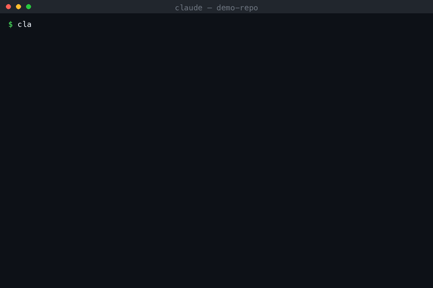

# nunchi

[](LICENSE)
[](https://github.com/seob717/nunchi/releases)

*"Rules with nunchi — delivered before you have to ask."*

nunchi is a Claude Code plugin that turns CLAUDE.md rules into event listeners. Instead of loading every rule at session start and hoping it survives 40 turns and a compaction, each rule is delivered at the exact moment its action fires:



*(real session, replayed — the first `gh pr create` is denied exactly once, with the full rules doc — read from `docs/pr-rules.md` at that moment — as the deny reason; the retry passes)*

One `/nunchi:compile` turns your CLAUDE.md into trigger-bound rule files; a PreToolUse hook does the delivery from then on. What you get, all [measured](#measured-results):

- **−42.5% tokens at session start** — moving 8 rule docs (~76KB) out of `@imports` saved ~34k prompt tokens per session start; the full doc is paid only in sessions where its action actually fires.
- **Rules survive compaction** — a SessionStart hook re-arms delivered rules after every `/compact`, verified across repeated compactions.
- **Every delivery is logged** — `/nunchi:report` shows which rule fired when, and what it saved in your repo.

## Quick start

Requires [Claude Code](https://code.claude.com) with plugin support, and Python 3 (the hook engine runs on the standard library only — no external packages).

```
/plugin marketplace add seob717/nunchi
/plugin install nunchi@nunchi-marketplace
```

Then, inside your project:

1. **`/nunchi:compile`** — reads CLAUDE.md and the `@referenced` documents inside it, extracts rules, infers a trigger (tool, regex pattern) for each, and writes them to `.claude/rules/*.md`.
2. **Review the rule files** — they are plain text and the source of truth. Check that each trigger, strength, and source path is right; fix by hand if needed.
3. **Done.** From now on the PreToolUse hook delivers each rule right before the action it applies to. `/nunchi:report` shows what was delivered, when, and what it saved.

<details>
<summary>Install from a local directory instead</summary>

```bash
git clone https://github.com/seob717/nunchi.git
claude --plugin-dir /path/to/nunchi
```

</details>

## The problem

A rule you write in CLAUDE.md is loaded once, at t=0 when the session starts, and that's it. But the moment that rule actually matters is usually dozens of turns later. As context piles up, the model's attention on a rule from the top of the session fades, and once a compaction (summary) passes through, an explicit rule gets demoted to blurry background. A referenced document like `@docs/pr-rules.md` ends up furthest from context at exactly the point where the rule is needed (e.g. when running `gh pr create`). nunchi compiles a rule not as a "declaration at the top of the session" but as an "event listener bound to an action," collapsing the distance between when a rule is needed and when it is delivered to zero.

## How it works

1. **`/nunchi:compile`** — Reads CLAUDE.md and the `@referenced` documents inside it, extracts rules, infers a trigger (tool, regex pattern) for each rule, and compiles them into `.claude/rules/*.md`.
2. **Review the rule files** — The compiled output is plain-text files you can read and edit. Check that the trigger, strength, and source document path are correct, and fix them by hand if needed. These files are the source of truth.
3. **Just-in-time delivery at the moment of action** — A PreToolUse hook intercepts tool calls and matches them against triggers. On a match, it reads the `source` document directly at that moment (the original, not a pasted copy) and delivers it. When several rules match the same tool call, their contents are delivered together in a single block, so one action costs at most one retry.
4. **Re-arm after compaction** — A SessionStart hook scoped to compaction resets the session's delivery markers, so a rule that was already delivered before a compaction (and whose text was therefore summarized away) is delivered again, just-in-time, the next time its trigger matches. No context is spent at compaction time.

## Rule file format

```markdown
---
name: pr-rules
trigger:
  tool: Bash
  pattern: gh\s+pr\s+create
source: docs/pr-rules.md
strength: require-read
enabled: true
---
Reflect docs/pr-rules.md before creating a PR.
```

- `name`: lowercase letters, digits, and hyphens only (`[a-z0-9][a-z0-9-]*`). A file with an invalid name is rejected with a stderr warning instead of silently misbehaving.
- `trigger.tool` / `trigger.pattern`: which tool call to intercept, and with what regex. By default the pattern matches a Bash rule against the command string and an Edit/Write rule against the file path.
- `trigger.field` (optional): match against a specific `tool_input` field instead of the default. `field: new_string` on an Edit rule makes content rules expressible — e.g. pattern `console\.log` fires when the *edit being written* contains `console.log`, regardless of the file path.
- `trigger.path` (optional): a file-path regex ANDed with `pattern` — the rule fires only when both match. Scope content rules to code files (`path: \.(ts|tsx)$`) so example code inside markdown or docs doesn't trigger them; without it, a `field: new_string` rule blocks *any* file whose edit contains the pattern — including the rule's own source document.
- `source`: the path to the original document, read on the spot at delivery time. If the original changes, the change is reflected automatically from the next delivery on. When several rules share one source, the document travels in full **once per session** — later deliveries carry the rule's one-line body plus a pointer to the full text already in the transcript, instead of repeating the document.
- `strength`: three levels, in decreasing order of enforcement.
  - `block` — always block, delivering the rule as the reason. For actions a document marks as absolutely forbidden. Repeat attempts in the same session stay blocked, but with an abbreviated reason (one-line body + a pointer to the full text delivered earlier) — enforcement unchanged, tokens saved.
  - `require-read` (default) — block once per session with the rule text as the reason, then let the retry through. One retry buys a guaranteed read.
  - `inject` — deliver the rule via `additionalContext` alongside the tool call, with **zero blocking and zero retry cost**. The delivery carries a provenance framing (project-owner hook, registered rule path, `source` path) because we measured that unframed injected instructions get treated as prompt injection and refused, while framed ones are followed (see `pilot/PROBE-inject.md`). Softer than `require-read`: compliance rides on the model's judgment instead of a forced retry. nunchi never returns `permissionDecision: allow`, so your permission prompts are untouched.
- Body: a summary to deliver instead of, or in addition to, the original document. **Keep it to one line** — see below.

### Interaction with Claude Code's native `.claude/rules/` loader

Claude Code itself (v2.0.64+) also reads `.claude/rules/*.md`: a file without a `paths:` frontmatter key gets its body loaded into context at session start (verified by probe on v2.1.206). nunchi embraces this rather than fighting it — the two loaders split the work:

- The **body** doubles as an always-on one-line declaration, natively loaded at t=0 ("PR rules exist for this repo").
- The **source document** is what nunchi delivers just-in-time, in full, at the moment the trigger fires.

This is why rule bodies must stay at one summary line: a long body would be injected at session start *and* delivered again at trigger time. `/nunchi:compile` generates bodies this way by default.

### Keeping compiled rules fresh

Changes to a rule's *content* need nothing from you — the `source` document is read fresh at every delivery. What can silently go stale is the *trigger structure*: a new rule added to the document, a rule rebound to a different action, or a changed prohibition strength, none of which take effect until `/nunchi:compile <path>` is re-run. Three signals cover this (from [#17](https://github.com/seob717/nunchi/issues/17)):

- **Edit-time reminder** — when a tool call edits a document that is the `source` of a compiled rule, the hook injects a once-per-session note naming the affected rules and the exact recompile command. Non-blocking (`additionalContext` only), and it reuses the rule list already loaded for matching, so calls that touch nothing pay nothing.
- **`/nunchi:report` candidates** — rules whose `source` document is newer on disk than the compiled rule file are listed as recompile candidates (mtime heuristic; a fresh clone resets mtimes, so treat it as a prompt, not proof).
- **Convention watcher (opt-in)** — if your rule documents follow a path convention like `docs/*-rules.md`, an ordinary nunchi rule can watch the convention itself and suggest compiling newly created documents (`/nunchi:compile` offers to generate it; see the compile command's §5.6). No extra config surface — the watcher is just another rule file.

The one gap none of these catch is trigger drift with no document change at all (the team switches `gh` → `glab` and the PR rules doc never mentions tooling) — that surfaces as a dead rule in `/nunchi:report` (delivered 0 times), which is why the report flags never-triggered rules.

## Measured results

Measurement harness: a sandbox repo + a mock `gh` (captures PRs) + 4 machine-gradable PR rules + headless `claude -p` (sonnet), 3 runs per condition. (The full harness is preserved in the `pilot/` directory so it can be re-run.)

| Condition | Description | All-pass | Notes |
|---|---|---|---|
| A | CLAUDE.md only (short context) | 3/3 | Ceiling effect — the rule was just loaded, so it doesn't collapse under this pressure |
| AL | CLAUDE.md only + long context (~60k tokens) | 3/3 | The ceiling effect persists even in long context |
| HW | hookify warn | 3/3 | The warning message never reaches the model, so effectively the same condition as A |
| HB | hookify block | 0/3 | It doesn't populate `permissionDecisionReason`, so the model is blocked without knowing why, destroying 3/3 of the tasks |
| Z | nunchi JIT delivery (real engine, E2E) | 3/3 | Hook fired 3/3 — the first attempt is blocked while the reason (the rule's original text) is delivered, and all retries pass |

What this table shows is *not* an edge of "JIT has a higher compliance rate than CLAUDE.md" — at this pilot's pressure level (4 simple rules, a single task, sonnet), even CLAUDE.md alone (A, AL) held up with a ceiling effect, and we don't hide that result. What the measurement actually supports is three things:

1. **hookify block is harmful.** A block that doesn't communicate the reason destroys 3/3 of the tasks. The same block, when it delivers the reason alongside it (the nunchi way), flips 0/3 → 3/3.
2. **The JIT delivery mechanism itself works and does not hurt the task.** In the E2E with the real nunchi engine attached (condition Z), the hook fired 3/3 normally, and all 3 runs — blocked, then given the reason and retried — completed the task.
3. **Source-document sync and delivery logging actually work.** Because `source` is read every time at delivery, the rule and its original never drift apart, and every trigger, delivery, and block is recorded as JSONL and aggregated by `/nunchi:report`.

**Pressure re-verification (pre-registered):** we then scaled the pressure to 24 rules behind a 3-level `@reference` structure plus the same ~268KB long-context task and re-ran the CLAUDE.md-only condition (design and results: `pilot/DESIGN-pressure.md`, `pilot/RESULTS-pressure.md`). The ceiling held — all-pass stayed 100% across 5 valid runs (40/40 graded checkpoints), so the pre-registered gate for a confirmatory JIT-vs-CLAUDE.md comparison was not met and we did not run it.

**Compaction pressure (pre-registered):** we then forced a `/compact` mid-task and graded only post-compaction behavior (design and results: `pilot/DESIGN-compaction.md`, `pilot/RESULTS-compaction.md`). The CLAUDE.md-only condition produced its first observed rule violation across all experiments (a PR labeled with a value outside the allow-list that lives only in an `@referenced` doc — exactly the detail compaction discards), but at 2/3 all-pass the pre-registered gate was again not met, so no confirmatory comparison was run and no superiority claim is made. What the runs do support: the re-arm mechanism worked in 3/3 treated runs (deliver → compact → re-arm → re-deliver), and JIT delivery still didn't hurt task completion after compaction (3/3 all-pass). Whether JIT shows a compliance edge under stronger pressure remains unverified, and we don't make that claim until it is.

**Compaction follow-up (pre-registered):** two further arms (design and results: `pilot/DESIGN-compaction-followup.md`, `pilot/RESULTS-compaction-followup.md`). A 10-run expansion of the CLAUDE.md-only compaction condition produced no new violations in 9 valid runs, putting the observed single-compaction violation rate at 1/12 (~8%). A double-compaction preflight (3-stage task, two forced `/compact`s) again did not meet the pre-registered gate (all valid baseline runs passed), so no superiority comparison was run and none is claimed. What it did verify: **the re-arm mechanism survives repeated compaction** — deliver → compact → re-deliver → compact → re-deliver again, in 2/2 valid treated runs — and JIT delivery still didn't hurt task completion after two compactions.

**Context economics (measured probe):** `@imported` files are "expanded and loaded into context at launch" ([official memory docs](https://code.claude.com/docs/en/memory)), and the official best practices warn that "longer files consume more context and reduce adherence" ([best practices](https://code.claude.com/docs/en/best-practices)) — the official remedy, path-scoped rules, covers file-read triggers; nunchi extends the same idea to action triggers with enforcement. Moving rule documents out of CLAUDE.md `@imports` and into nunchi rules changes when their tokens are paid. We measured it head-to-head (`pilot/PROBE-context-economics.md`): the same repo with 8 rule docs (~76KB) loaded via `@import` cost **79,683 prompt tokens at session start**; the nunchi configuration (one-line rule bodies, docs delivered just-in-time by trigger) cost **45,808** — a saving of **~34k tokens (−42.5%) per session start**, with the rule-doc payload itself dropping 97% (34,878 → 1,003 tokens). The full document is then paid only in sessions where its action actually fires, at the moment it fires. Two honesty caveats: a doc that also carries always-on guidance (about half of wild rules, per the compile benchmark below) should keep its `@reference` — the saving applies to action-bindable docs; and in a session that triggers many rules the delivery spend adds back up, arriving as precisely-timed context rather than upfront freight. `/nunchi:report` computes these numbers for your own repo from your rule files and delivery logs.

**Compile benchmark on wild CLAUDE.md files (pre-registered pilot):** we ran the `/nunchi:compile` instructions over 12 real-world CLAUDE.md files (166KB total: apache/airflow, vercel/next.js, supabase, plus a deterministic sample from [awesome-claude-md](https://github.com/josix/awesome-claude-md), with an empty-stub negative control) — design and results: `pilot/DESIGN-compile-bench.md`, `pilot/RESULTS-compile-bench.md`. Of 88 extracted rules: 100% valid regexes and tools, 100% of content rules carried the required `path:` scope, zero fabricated rules on the empty control, and all 8 `block`-strength assignments traced to explicit "Never/MUST NOT" wording in the source (verified quote-by-quote). About half of wild rules (51%) were action-bindable at all — the other half is always-on guidance, which is exactly why nunchi is designed to coexist with CLAUDE.md rather than replace it. Recall against an adversarial gold set (181 rules authored by a separate model in isolated sessions) is **35% micro-recall** — measured, not hidden (`pilot/RESULTS-compile-recall.md`, `pilot/RESULTS-compile-recall-v2.md`). About a third of those misses are the compiler *deliberately* skipping non-action-bindable guidance (self-reported in its own output), and the gold set splits rules more finely than the spec's one-rule-per-trigger policy — but real gaps remain (rules inside tables and deep lists), and closing them is tracked openly in issues.

**Multilingual compile compatibility (pre-registered pilot):** the same compile instructions run over Korean/Japanese/Spanish translations of three of those documents showed no degradation in recall, output format, or over-extraction versus the English originals (`pilot/RESULTS-compile-multilingual.md`) — the one axis that wobbled across languages was **strength**: recommendation vs. prohibition nuance ("avoid" vs. "never") distorts in translation. Adding a speech-act judging principle with per-language calibration examples to the compile spec lifted gold-strength agreement from 61% to 82% with zero regression on the gated metrics (`pilot/RESULTS-strength-guidance.md`). The same pipeline was then run on four *wild* Korean CLAUDE.md files sampled deterministically from GitHub (including pinpoint-apm/pinpoint, ★13.8k): zero format violations, zero over-extraction, zero fabricated evidence, and 88% strength agreement — wild prohibitions like "master에는 절대 직접 커밋하지 않습니다" all compiled to `block` (`pilot/RESULTS-compile-wild-ko.md`). For authors writing CLAUDE.md in Korean, there is a phrasing guide: [`guides/writing-korean-claude-md.md`](guides/writing-korean-claude-md.md) (in Korean).

## FAQ — "isn't this just…?"

**…shrinking CLAUDE.md?** Dieting CLAUDE.md reduces the upfront token bill but keeps the delivery model: everything you kept still loads at t=0 and fades with distance and compaction. nunchi changes *when* a rule arrives, not just how much of it there is — the rule text lands in context milliseconds before the action it governs, and again after every compaction. Measured either way: the observed baseline failure is exactly a post-compaction violation of a rule that lived in an `@referenced` doc (`pilot/RESULTS-compaction.md`).

**…Claude Code's path-scoped rules (`paths:` frontmatter)?** Path-scoped rules trigger on *reading files*. nunchi triggers on *actions*: `gh pr create`, `git commit`, the content of the edit being written (`trigger.field: new_string`), with per-session delivery state and three enforcement strengths. The two compose — nunchi's rule files are native `.claude/rules/` files, and the native loader injects their one-line bodies at session start while nunchi delivers the full source document at trigger time.

**…a skill?** Skills and nunchi share the same context shape — a one-line declaration always loaded, the full body just-in-time — but the trigger owner differs. A skill is *pulled*: the model must recognize from the description that it's needed and open it, and no mechanism forces a skill to fire before a given action (the [official docs](https://code.claude.com/docs/en/skills) point to hooks when a guarantee is needed). Rule compliance fails exactly when the model has forgotten a rule exists — and a model that forgot the rule won't open its skill either. nunchi is *pushed*: the action itself is the trigger, so delivery doesn't depend on the model remembering anything; it can enforce (`require-read`/`block` — skills are advisory only), and every delivery is logged. In short: **skills work when the model remembers; nunchi works when it forgets.** The two compose — put procedures (release steps, migration workflows) in skills, and let nunchi guard the actions those procedures take: a skill that runs `gh pr create` mid-procedure gets the PR rules delivered right there.

**…an MCP/output-compression tool like Context Mode or RTK?** Those compress what flows *into* context (MCP output, Bash output). nunchi doesn't compress anything — it schedules rule delivery. Token saving is a side effect of not front-loading documents; the product is that the rule is provably in context at the moment of the action, and every delivery is logged so you can audit compliance instead of assuming it.

**…hoping the regex matches?** Triggers are deterministic regexes by design — auditable, testable, no retrieval variance. The cost is honest: a mis-scoped pattern misses or over-fires. That's why compiled rule files are plain text you review (step 2 of Quick start), why content rules are required to carry a `path:` scope, and why the compile spec itself is benchmarked for format validity (100%) and fabrication (0) on wild corpora.

## How nunchi compares

Different tools solve different layers of "make the agent follow the rules". Static distributors ([Ruler](https://github.com/intellectronica/ruler), [rulesync](https://github.com/dyoshikawa/rulesync)) answer *"how do I ship the same rules to every agent?"*. Guardrail hooks ([hookify](https://github.com/anthropics/claude-code/tree/main/plugins/hookify)) answer *"how do I stop a bad action?"*. [Skills](https://code.claude.com/docs/en/skills) answer *"how do I give the agent a procedure without paying for it up front?"*. nunchi answers *"how do I get the right rule into the model's context at the moment it matters — and keep it there across compactions?"*. These compose: you can distribute rule documents with Ruler, put procedures in skills, and deliver the rules with nunchi.

The table below is a **scope map, not a scoreboard** — an empty cell or a "by design" note usually marks a deliberate design choice, and several rows go the other way (hookify covers more hook events, Writ retrieves semantically, Ruler distributes to 30+ agents — none of which nunchi does).

| Capability | nunchi | hookify | Claude Code native rules | Claude Code Skills | Ruler / rulesync | Writ |
|---|---|---|---|---|---|---|
| Action (command) triggers — `gh pr create`, `git commit` | ✅ | ✅ | file-read path globs | model-pulled² | out of scope¹ | partial (built-in gates) |
| Content triggers — what's being *written* | ✅ `trigger.field` | ✅ | — | — | out of scope¹ | partial (static-analysis pre-write) |
| Delivers rule text **to the model** on block | ✅ reason | Stop ✅ / PreToolUse: user-facing message | — | advisory only — cannot block | out of scope¹ | ✅ rule ID + reason |
| Non-blocking JIT injection | ✅ `inject` | — | at file-read | ✅ at invocation² | out of scope¹ | ✅ every turn (retrieval) |
| Delivery state — once per session, no block loops | ✅ | stateless by design | — | identical re-invocation deduped | out of scope¹ | ✅ per-phase IDs + token budget |
| Re-armed after compaction | ✅ measured 5/5 | stateless by design | root CLAUDE.md documented; rules files unspecified | budgeted re-attach (oldest dropped) | out of scope¹ | ✅ PostCompact re-inject |
| Source document read at delivery time (no drift) | ✅ | message lives in the rule file | ✅ | ✅ body read at invocation | copied at generation | ✅ |
| Delivery log + report | ✅ JSONL, `/nunchi:report` | — | — | — | out of scope¹ | ✅ friction log + dashboard |
| Hook events beyond PreToolUse (PostToolUse, Stop, UserPromptSubmit) | not yet — Stop rules on the roadmap | ✅ 4 events | — | skill-scoped hooks in frontmatter | — | ✅ broad coverage |
| Semantic rule matching (meaning, not regex) | regex by design (deterministic) | regex | path globs | ✅ description matching | — | ✅ hybrid-RAG |
| Multi-agent rule distribution (Cursor, Cline, …) | not planned | — | — | ✅ portable SKILL.md (open standard) | ✅ 30+ agents | — |
| Runtime dependencies | Python stdlib | Python stdlib | built-in | built-in | Node | Docker + Neo4j + FastAPI |
| Published compliance measurements | pre-registered runs above | — | — | — | — | qualitative pressure-run transcripts |

¹ Ruler and rulesync are static distributors by design — they generate config files and hand off to each agent's own runtime, so runtime-delivery rows simply don't apply to them.

² Skills are model-invoked: the model matches the request against each skill's description. Nothing binds a skill to a tool call, and nothing forces it to fire before an action — invocation rides on the model's judgment, and the [official docs](https://code.claude.com/docs/en/skills) point to hooks when a guarantee is needed. See the FAQ entry above.

Hook overhead, measured: ~24ms median per tool call (26ms when a rule is delivered). Rows verified against each tool's source or official docs as of July 2026 — corrections welcome via issue.

Credit where due: hookify pioneered markdown-frontmatter rules on Claude Code hooks and covers more hook events (PostToolUse, Stop, UserPromptSubmit); Skills are the right home for procedures — progressive disclosure at ~100 tokens per skill plus execution controls (`allowed-tools`, model/effort overrides, forked context) that nunchi doesn't have; Ruler and rulesync solve cross-agent distribution properly; Writ explores semantic retrieval-based delivery. nunchi's niche is deliberately narrow: deterministic, action-triggered delivery with delivery-state tracking — and only measured claims.

## Development

```bash
uvx pytest tests/              # run the test suite (stdlib-only code, pytest as the runner)
uvx pre-commit run --all-files # lint & format (ruff)
```

## Contributing

Issues and PRs are welcome. Commit messages must follow [Conventional Commits](https://www.conventionalcommits.org/) (`feat:`, `fix:`, `docs:`, …) — [release-please](https://github.com/googleapis/release-please) derives versions and the changelog from them.

## Limitations and roadmap

The following are not implemented yet and are on the roadmap.

- **Semantic judging**: inspecting output content with an LLM to catch rule violations, rather than a regex trigger. This needs a latency/cost tradeoff review.
- **Stop-event rules**: rules that check "was this condition satisfied before the task completed?" at session-end time.
- **Compliance report UI**: right now `/nunchi:report` only aggregates the log into a table; more sophisticated analysis is in the backlog.

Also, these results come from an n=3-per-condition pilot plus a pre-registered pressure preflight (6 runs). Statistically, "100%" means no more than "we observed no failure in this sample," and any claim of a JIT compliance edge still awaits a pressure level that actually breaks the baseline.

## License

[MIT](LICENSE)

---

If nunchi keeps your rules alive when they matter, a ⭐ on this repo helps others find it.
